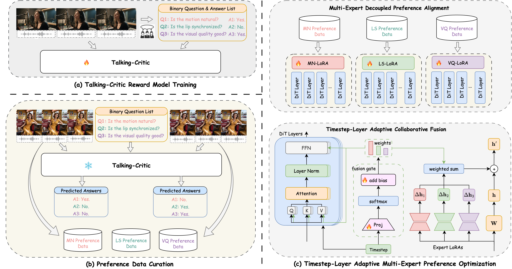

# FantasyTalking2: Timestep-Layer Adaptive Preference Optimization for Audio-Driven Portrait Animation
[](https://fantasy-amap.github.io/fantasy-talking2/)
[](https://arxiv.org/abs/2508.11255)
<!-- [](https://arxiv.org/abs/2508.11255) -->

## Abstract

Recent advances in audio-driven portrait animation have demonstrated impressive capabilities. However, existing methods struggle to align with fine-grained human preferences across multiple dimensions, such as motion naturalness, lip-sync accuracy, and visual quality. This is due to the difficulty of optimizing among competing preference objectives, which often conflict with one another, and the scarcity of large-scale, high-quality datasets with multidimensional preference annotations. To address these, we first introduce Talking-Critic, a multimodal reward model that learns human-aligned reward functions to quantify how well generated videos satisfy multidimensional expectations. Leveraging this model, we curate Talking-NSQ, a large-scale multidimensional human preference dataset containing 410K preference pairs. Finally, we propose Timestep-Layer adaptive multi-expert Preference Optimization (TLPO), a novel framework for aligning diffusion-based portrait animation models with fine-grained, multidimensional preferences. TLPO decouples preferences into specialized expert modules, which are then fused across timesteps and network layers, enabling comprehensive, fine-grained enhancement across all dimensions without mutual interference. Experiments demonstrate that Talking-Critic significantly outperforms existing methods in aligning with human preference ratings. Meanwhile, TLPO achieves substantial improvements over baseline models in lip-sync accuracy, motion naturalness, and visual quality, exhibiting superior performance in both qualitative and quantitative evaluations.

## 🔗Citation
If you find this repository useful, please consider giving a star ⭐ and citation
```
@misc{wang2025fantasytalking2timesteplayeradaptivepreference,
      title={FantasyTalking2: Timestep-Layer Adaptive Preference Optimization for Audio-Driven Portrait Animation}, 
      author={MengChao Wang and Qiang Wang and Fan Jiang and Mu Xu},
      year={2025},
      eprint={2508.11255},
      archivePrefix={arXiv},
      primaryClass={cs.CV},
      url={https://arxiv.org/abs/2508.11255}, 
}
```
